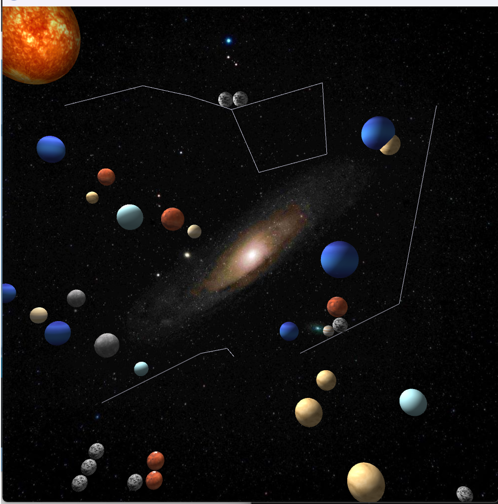

# PinballSimulation

A simple Pinball Simulation created for CSCI 5611 by Omar Salem

## Demo
[YouTube Demo](https://youtu.be/iLWauZHaMYc)
### Features & Timestamps
1. 01:36 - Basic Pinball Dynamics
    The ball can be seen accelerating as it falls and bouncing naturally with multiple objects
2. 01:56 - Multiple Pinballs Interacting
    Balls interact with each other in a natural fashion where the balls will impact the momentum of the others as they collide, resulting in a change in velocity that keeps momentum generally constant
3. 02:25 - Circular Obstacles
    Multiple obstacles can be seen on the screen that do not move (the planets) and the ball can be seen bouncing off of them and being reflected in a way that does impact the position of the obstacle
4. 01:56 - Line Segment Collision
    There are a few line segments (presented by constellations) that show the balls bouncing off of them and also sliding as expected without clipping through the lines
5. 02:40 - Textured Background
    An image of space was used as a background image and it matches with the theme of the simulation
6. 02:25 - Textured Obstacles
    The obstacles are textured as planets in the solar system and randomly generated throughout the scene and rotate in place
7.  00:15 - 3D Rendering
    The whole simulation aside from the background and lines are rendered in 3D with obstacles on top. One of the obstacles was chosen as a "sun" and there is light coming from it to shine on the rest of the obstacles. The other obstacles are planets and the balls are asteroids. The obstacles rotate around their Y axis while the balls do not

## Difficulties Encountered
1. Line Collisions
    Line collisions took a very big deal of my time because it had many problems that caused balls to phase through when they are at high speeds. Additionally, the balls sometimes would get launched through the line if the center of the ball is ever slightly below the line. 
2. 3D Rendering
    3D rendering was a big problem, far bigger than lines, because I had zero experience and idea of what to do. I ended up choosing to use he Shapes3D library because it had documentation and code examples which made it far easier to understand what it is that I had to do. Additionally, getting 3D shapes to rotate and translate to the correct place was difficult, and even now there sometimes looks like there is a very small overlap between the 3D models of shapes, even though the 2D math is correct and recognizes that the shapes are not overlapping, but visually the 3D models are. Most of that problem has been removed, but I believe there may still be some odd edge cases still there.
## Libraries used

The only library used is the Shapes3D library by Peter Lager

This must be installed before running or else the game won't start

To do so, after opening the Processing editor, you can go to `Sketch > Import Library > Manage Libraries` and you can search for the Shapes3D library and install it
## Attribution

### Code
All code used was either written by me or provided in class, with the exception of a function that I didn't know about, so I got it through ChatGPT and it is credited in the comments

### Images
For all the planet and sun textures - [solarsystemscope.com](https://www.solarsystemscope.com)

For the asteroid texture - <a href="https://www.freepik.com/free-photo/abstract-wall-stone-texture_39252485.htm#query=asteroid%20texture&position=10&from_view=keyword&track=ais">Image by YusufSangdes</a> on Freepik

For the background image - [Pexels.com](https://www.pexels.com)